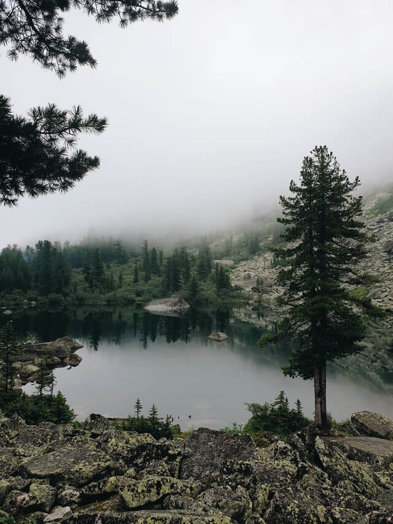

# Проект: Место
Интерактивная страница сайта, куда можно добавлять фотографии, удалять их и ставить лайки.
Проект доступен по ссылке:
https://yaanab.github.io/mesto/index.html

## В проекте реализованы:
:white_check_mark: Адаптивная верстка 
:white_check_mark: Методология БЭМ. Файловая структура CSS оформлена по правилам Nested БЭМ  
:white_check_mark: Элементы JavaScript. Работа с DOM 

### Планы по доработке:
:black_square_button: Реализовать возможность изменения аватара 
___

